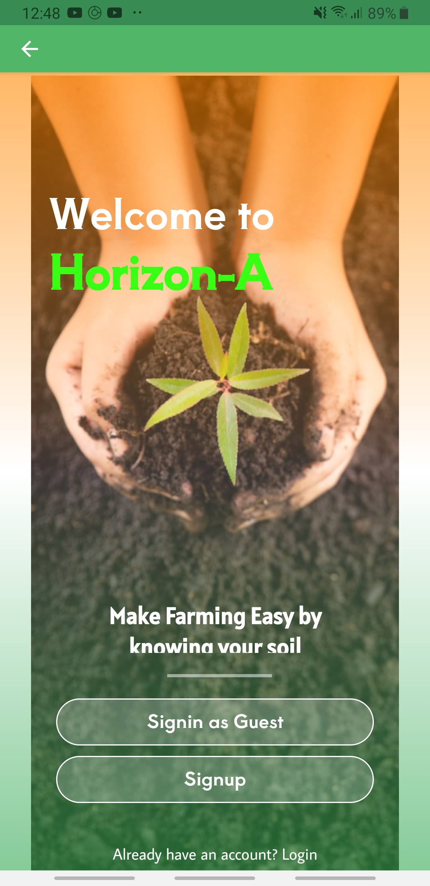
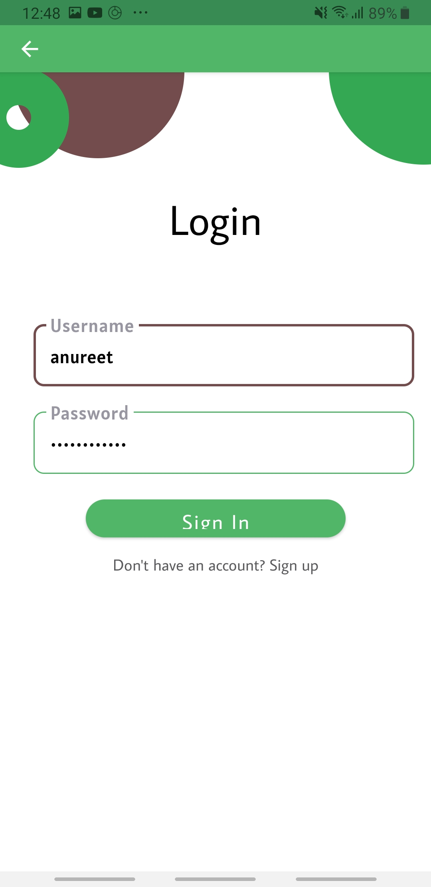
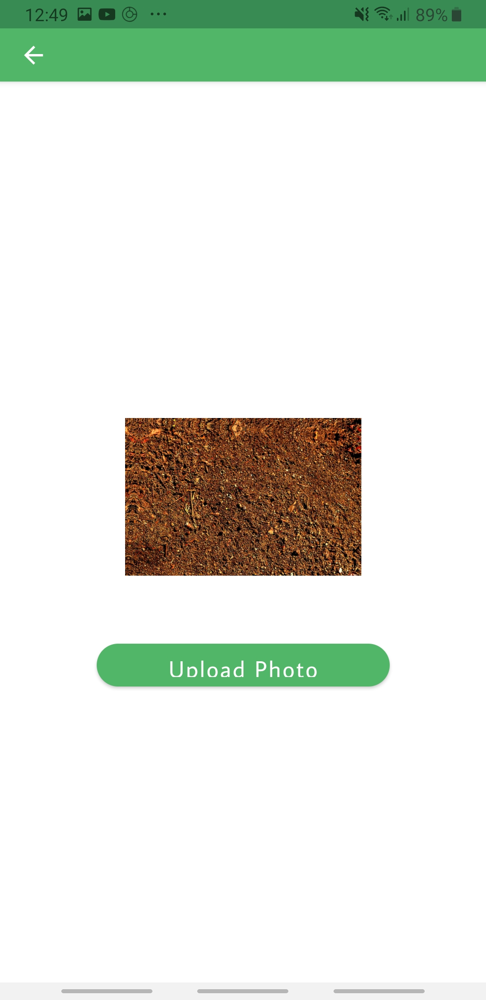
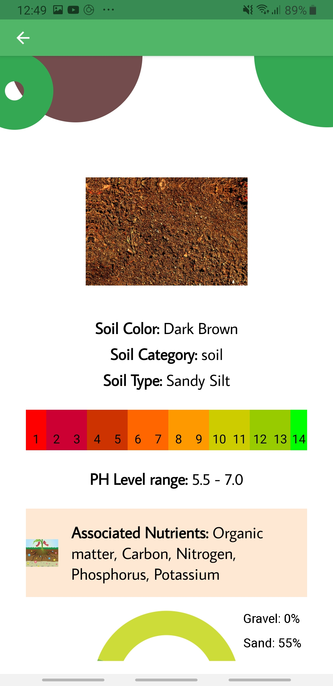
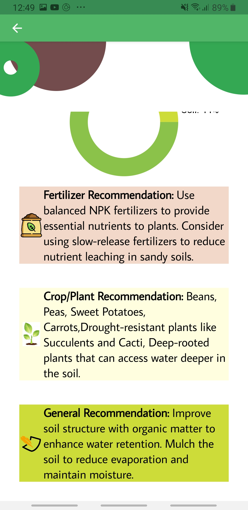

# HorizonA
Welcome to the Soil Analysis Application, a powerful tool for analyzing soil properties and providing valuable recommendations for optimal soil health. This application utilizes machine learning algorithms to determine various aspects of soil based on uploaded images. Whether you're a farmer, gardener, or environmental enthusiast, our app empowers you to make informed decisions about soil management.

This is an android application which is build using kotlin jetpack compose.

## Welcome Screen

## Login Page

## Upload Image Page

## Dashboard

\

# Features
- [x] **User Authentication**: Securely manage your account with AWS-powered login and signup functionalities. Your data is safe and accessible only to you.

- [x] **Image Selection and Upload**: Choose from your device's gallery or capture images of soil samples. Upload these images to the app for analysis.

- [x] **Machine Learning Algorithms**: Our cutting-edge machine learning algorithms process the uploaded images to determine key soil properties:
  - [x] **Soil Color**: Gain insights into soil coloration, which can indicate soil composition and health.
  - [x] **Cation Exchange Capacity (CEC)**: Understand the soil's ability to hold and exchange essential nutrients.
  - [x] **pH Level**: Determine the acidity or alkalinity of the soil, a crucial factor for plant health.
  - [x] **Associated Nutrients**: Identify nutrient levels present in the soil, helping you optimize fertilization strategies.

- [x] **Dashboard**: The user-friendly dashboard provides a comprehensive overview of the analyzed soil sample:
  - [x] **Visual Representation**: See a graphical representation of soil color, making it easy to compare and track changes over time.
  - [x] **Cation Exchange Capacity**: View the CEC value, which influences nutrient availability to plants.
  - [x] **pH Level**: Understand the pH level and its impact on plant growth.
  - [x] **Nutrient Insights**: Get detailed information about the nutrients present in the soil and their implications.

- [x] **Fertilizer Recommendations**: Based on the analyzed data, receive tailored fertilizer recommendations to enhance soil fertility and optimize plant growth.

- [x] **General Recommendations**: Access general suggestions for soil management and improvement based on the soil's characteristics.

# Getting Started
You need to have android studio installed on your device and create an Android Virtual Device to run full Android OS and test the application.

## Installation
To install and run the Soil Analysis Application locally, follow these instructions:

1. Clone the repository
2. Open Android Studio and navigate to the project directory
3. Build and Sync Gradle
4. Configure AWS Credentials
5. Run the application
6. Access the application on your emulator or device

## After Installation
To begin using the Soil Analysis Application, follow these steps:

1. Sign up for an account using your email and password.
2. Log in to the application securely.
3. Choose an option to upload soil sample images from your device's gallery or capture new images.
4. Wait for the machine learning algorithms to process the images and analyze the soil properties.
5. Explore the dashboard to view the analyzed soil characteristics, including color, CEC, pH level, and nutrient details.
6. Utilize the provided fertilizer and general recommendations to make informed decisions about your soil management practices.

## Machine Learning Part

For the machine learning part, the application utilizes the machine learning algorithms and resources from the [Horizon-A repository](https://github.com/DhruvPatel96/Horizon-A). This repository contains the code and models that are used to analyze the uploaded soil images and determine various soil properties.
